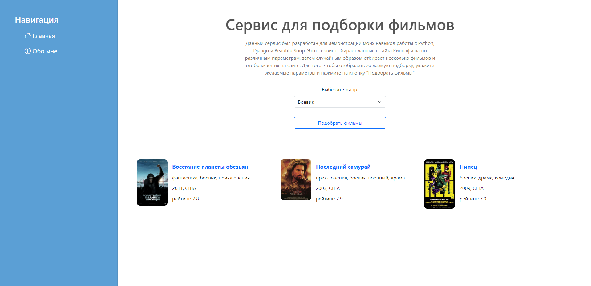

 

  <h3 align="center">Приложение для подборки фильмов</h3>

  

    Данный проект был выполнен мной для изучения фреймворка Django и библиотеки BeautifulSoup.
     
     
  

## О проекте

  

Приложение создано на языке Python.
Данное приложение позволяет выбрать жанр нужных фильмов, после чего предоставляет пользователю 3 случайных фильма с сайта Киноафиша, которые парсятся при помощи BeautifulSoup.

Приложение всё ещё находится в разработке, однако демонстрирует мои навыки работы с Python, HTML и CSS.
